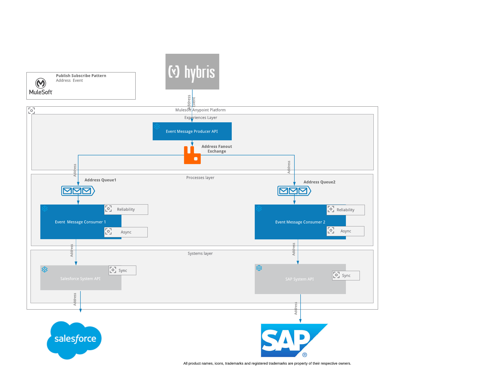
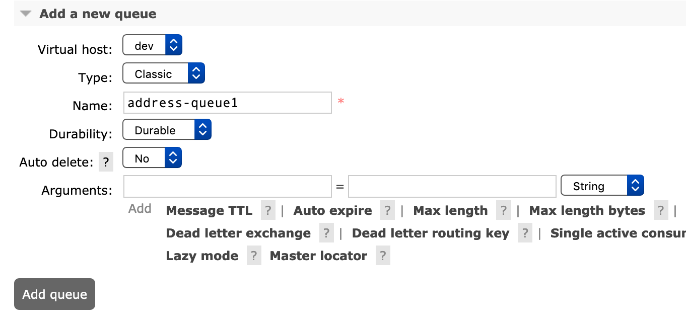
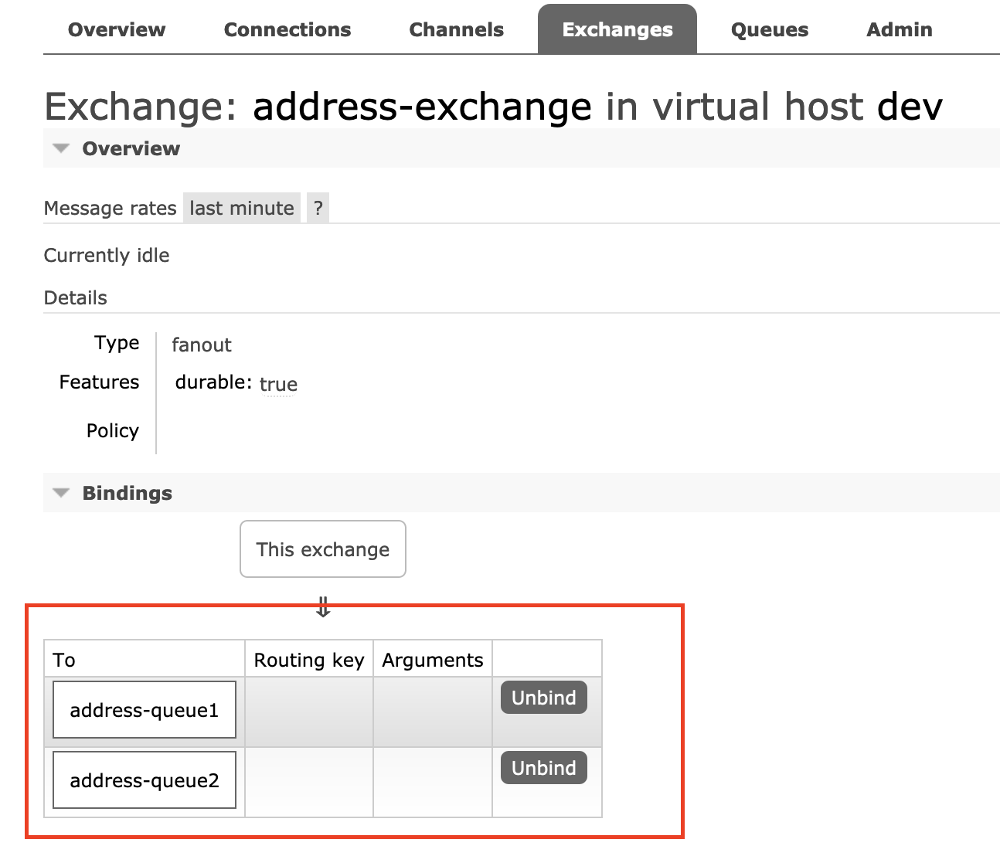

# Publish Subscribe Pattern

This is an example to showcase how publish subscribe pattern can be achieved using RabbitMQ

### What?

A Publish-Subscribe channel works like this: It has one input channel that splits into multiple output channels, one for each subscriber. When an event is published into the channel, the Publish-Subscribe Channel delivers a copy of the message to each of the output channels. Each output channel has only one subscriber, which is only allowed to consume a message once. In this way, each subscriber only gets the message once and consumed copies disappear from their channels.

### How?

The following diagram should articulate how this can be implemented:

### Usage
To test this example, you will require access to RabbitMQ. If not you can install it locally:

For RabbitMQ installation instructions please follow the link below :-
https://www.rabbitmq.com/download.html

After successful installation you should be able to run it Using

export PATH=$PATH:/usr/local/opt/rabbitmq/sbin
sudo rabbitmq-server

To access Rabbit MQ use the following url :-
http://localhost:15672/

Create Queues and Exchanges as per your configuration file.

Create Exchange as Fanout  :-

Create queue1 as follows :-

Create queue2 as follows :-

Create queue1 and queue2 binding as follows :-

Verify binding in exchange as shown below:-

#### Development

##### Dependencies

Rabbit MQ

### Contribution

### Todos

License
----
UNLICENSED
